# Roteiro Prático 04 — Vitrine Comunitária de Empreendedores Locais

**Unidade Curricular:** Programação para a Internet 2 (ProgWeb 2 / PIT II)  
**Curso:** Curso Superior de Tecnologia em Sistemas para a Internet  
**Instituição:** Instituto Federal de Santa Catarina (Câmpus Garopaba)  
**Docente:** Prof. André Moraes  
**Tema:** Arquitetura Modular Frontend: ES6 Modules, Padrão em Camadas & CRUD Completo no LocalStorage

---

## 🎯 Objetivos de Aprendizagem

- [x] Superar a arquitetura de arquivo único monolítico (`app.js`), adotando **ES6 Modules** (`import` e `export`) no navegador;
- [x] Declarar o ponto de entrada modular na página web via `<script type="module" src="js/main.js"></script>`;
- [x] Estruturar o frontend segundo a separação estrita de responsabilidades em **3 camadas + orquestrador**:
  - `js/services/`: Persistência pura e regras de negócio do CRUD via `localStorage`;
  - `js/views/`: Renderização dinâmica de cards e feedback flutuante com Bootstrap Toasts;
  - `js/utils/`: Funções utilitárias puras (moeda em Real `R$`, formatação com máscara de telefone e sanitização anti-XSS);
  - `js/main.js`: Orquestrador central que gerencia eventos do DOM e interliga as camadas.
- [x] Implementar o **CRUD Completo** (Create, Read, Update, Delete) no navegador:
  - **Create (Cadastrar):** Formulário modal com validação visual Bootstrap 5 (`was-validated`);
  - **Read (Listar & Filtrar):** Cards responsivos dinâmicos com filtro por categoria em tempo real;
  - **Update (Editar):** Carregamento dos dados no modal para alteração e regravação;
  - **Delete (Excluir):** Delegação de eventos no container para exclusão com confirmação.
- [x] Publicação da aplicação funcional no **GitHub Pages**.

---

## 📂 Estrutura de Arquivos e Pastas

Organize os diretórios do seu projeto rigorosamente na seguinte estrutura:

```text
roteiro-4/exercicio-roteiro4/
├── index.html                  # Interface completa: Header, Filtros, Vitrine e Modal de Cadastro/Edição
├── styles.css                  # Estilos complementares, tipografia Google Fonts e microinterações
└── js/
    ├── main.js                 # Ponto de entrada modular e orquestrador de eventos do DOM
    ├── services/
    │   └── vitrineService.js   # Regras de negócio e operações de CRUD no LocalStorage (sem DOM)
    ├── views/
    │   └── vitrineView.js      # Geração de marcação HTML dos cards e disparo de Toasts
    └── utils/
        └── formatters.js       # Funções utilitárias puras (moeda, fone e sanitização)
```

---

## 🚀 Pipeline Visual & Passo a Passo de Implementação

```mermaid
flowchart LR
    P1["<b>Passo 1: HTML5 &amp; Bootstrap</b><br/>index.html: CDNs, Modais,<br/>Toasts e &lt;script type='module'&gt;"]
    P2["<b>Passo 2: Utilitários Puros</b><br/>js/utils/formatters.js:<br/>formatarMoeda, fone e escapeHtml"]
    P3["<b>Passo 3: Serviços CRUD</b><br/>js/services/vitrineService.js:<br/>obter, salvar, atualizar e remover"]
    P4["<b>Passo 4: Camada de Visão</b><br/>js/views/vitrineView.js:<br/>criarCardHtml, render e Toasts"]
    P5["<b>Passo 5: Orquestrador</b><br/>js/main.js: validação BS5,<br/>filtros e delegação de cliques"]
    P6["<b>Conclusão &amp; Deploy</b><br/>Validação do CRUD e publicação<br/>no GitHub Pages (HTTPS)"]

    P1 --> P2 --> P3 --> P4 --> P5 --> P6

    classDef step fill:#f0f7ff,stroke:#1e3c5a,stroke-width:2px,color:#1e3c5a;
    classDef finalStep fill:#ecfdf5,stroke:#16a34a,stroke-width:2px,color:#16a34a;
    class P1,P2,P3,P4,P5 step;
    class P6 finalStep;
```



Siga a ordem lógica abaixo para reproduzir a aplicação com sucesso do início ao fim:

---

## 🧠 Conceitos Teóricos: Componentes Modernos de Interface (Bootstrap 5)

Antes de iniciar a codificação, é fundamental compreender a finalidade, o comportamento e a anatomia dos componentes visuais utilizados na aplicação:

### 1. Janelas Modais (*Modals*): Diálogos Sobrepostos de Alta Atenção
Uma **janela modal** é um elemento flutuante que surge acima do conteúdo principal da página, bloqueando temporariamente a interação com a tela de fundo por meio de uma camada escurecida semi-transparente chamada ***backdrop***.
- **Finalidade:** Concentrar a atenção exclusiva do usuário em uma tarefa pontual crítica (como preencher o formulário de cadastro ou editar um serviço) sem sair da tela atual nem recarregar a página (*Single Page Application*).
- **Croqui Anatômico do Modal:**
  ```text
  +------------------------------------------------------------------------+
  | [Fundo Escurecido: .modal-backdrop]                                    |
  |   +----------------------------------------------------------------+   |
  |   | .modal-dialog (centralizado via .modal-dialog-centered)        |   |
  |   |   +--------------------------------------------------------+   |   |
  |   |   | [1. .modal-header]                                     |   |   |
  |   |   |   Título do Diálogo (.modal-title)     [X] .btn-close  |   |   |
  |   |   +--------------------------------------------------------+   |   |
  |   |   | [2. .modal-body]                                       |   |   |
  |   |   |   .form-label, .form-control, .form-select,            |   |   |
  |   |   |   .invalid-feedback e <input type="hidden">            |   |   |
  |   |   +--------------------------------------------------------+   |   |
  |   |   | [3. .modal-footer]                                     |   |   |
  |   |   |                         [Cancelar]  [Salvar / Submit]  |   |   |
  |   |   +--------------------------------------------------------+   |   |
  |   +----------------------------------------------------------------+   |
  +------------------------------------------------------------------------+
  ```
- **Anatomia no Bootstrap 5 (conforme ilustrado acima):**

  | Elemento / Seletor | Camada Anatômica | Papel Arquitetural e Comportamento |
  | :--- | :--- | :--- |
  | `.modal` | Contêiner Base | Invisível por padrão (`display: none`), ativa transição suave (`.fade`) e bloqueio de fundo (*backdrop*). |
  | `.modal-dialog` | Geometria & Posição | Controla a largura responsiva e o alinhamento vertical no viewport via `.modal-dialog-centered`. |
  | `.modal-content` | Invólucro do Diálogo | Superfície branca com cantos arredondados e elevação (`.shadow-lg`), estruturada em 3 seções: |
  | `↳ .modal-header` | 1. Cabeçalho | Título da ação (`.modal-title`) e botão de fechar nativo (`.btn-close` com `data-bs-dismiss="modal"`). |
  | `↳ .modal-body` | 2. Corpo Central | Área nobre do formulário com rótulos, campos de entrada, validações e campo oculto (`#servicoId`). |
  | `↳ .modal-footer` | 3. Rodapé de Ações | Área de decisão e submissão com botões de controle (*Cancelar* e *Salvar*). |
  | `bootstrap.Modal` | Controle JavaScript | Instanciação programática (`getOrCreateInstance`) para abertura (`.show()`) e fechamento (`.hide()`). |

### 2. Notificações Flutuantes (*Toasts*): Feedback Assíncrono Não-Intrusivo
O componente **Toast** é uma notificação compacta e temporária que surge sobreposta em uma posição fixa da tela (canto superior direito) para confirmar o sucesso de operações.
- **Vantagem sobre o `alert()`:** O tradicional `window.alert()` é síncrono e bloqueante — congela a execução do JavaScript e força o usuário a clicar em "OK". O Toast é assíncrono, suave e desaparece sozinho após alguns segundos (*autohide*).
- **Posicionamento:** Usa um contêiner `.toast-container` com posição fixa (`position-fixed top-0 end-0 p-3`) e índice z prioritário (`z-index: 1090`).

### 3. Cartões de Conteúdo (*Cards*): Unidades Modulares e Grid Uniforme
Um **Card** (`.card .shadow-sm`) agrupa de forma coesa todas as informações e ações de um único registro:
- **Croqui Anatômico do Card:**
  ```text
  +------------------------------------------------------------------------+
  | .card .h-100 .shadow-sm (Contêiner com altura equalizada no grid)       |
  |   +----------------------------------------------------------------+   |
  |   | [1. .card-body]                                                |   |
  |   |   [.badge Categoria]                   R$ 25,00 (formatarMoeda)|   |
  |   |   Nome do Empreendimento (.card-title)                         |   |
  |   |   Bairro / Localização (.card-subtitle)                        |   |
  |   |   Texto descritivo dos diferenciais (.card-text .small)...     |   |
  |   +----------------------------------------------------------------+   |
  |   | [2. .card-footer .bg-transparent]                              |   |
  |   |   [WhatsApp: wa.me]                       [Editar]    [Excluir]|   |
  |   +----------------------------------------------------------------+   |
  +------------------------------------------------------------------------+
  ```
- **Anatomia no Bootstrap 5 (conforme ilustrado acima):**

  | Elemento / Seletor | Camada Anatômica | Papel Arquitetural e Comportamento |
  | :--- | :--- | :--- |
  | `.card` | Contêiner Modular | Unidade visual básica com borda suave e elevação sutil (`.shadow-sm`) que agrupa os dados de um serviço. |
  | `.h-100` | Equalização Vertical | Força 100% da altura da coluna no grid Flexbox, garantindo nivelamento visual uniforme na vitrine. |
  | `↳ .card-body` | 1. Corpo Principal | Abriga a badge de categoria, o título comercial (`.card-title`), o preço formatado, o bairro e a descrição. |
  | `↳ .card-footer` | 2. Rodapé de Ações | Fundo neutro transparente (`.bg-transparent`) agrupando os botões de ação: WhatsApp, Editar e Excluir. |

### 4. Validação Visual Nativa e o Campo Oculto (`<input type="hidden">`)
- **Atributo `novalidate`:** Suprime os balões padrão do navegador para que a aplicação utilize a validação visual do Bootstrap (classe `.was-validated` no formulário, combinada com mensagens `.invalid-feedback`);
- **Papel Arquitetural do Campo Oculto (`#servicoId`):** O campo com `type="hidden"` não é visível ao usuário, mas é o elemento-chave que diferencia as operações de **Criação** (*Create*) e **Atualização** (*Update*) no CRUD: se estiver vazio, a gravação cria um novo registro; se contiver um ID, atualiza o registro correspondente.

---

### Passo 1: Estrutura HTML5 Base e Modal (`index.html` e `styles.css`)

#### 1.1 Interface Completa (`index.html`)

Crie o arquivo `index.html` na raiz do projeto com toda a estrutura visual: CDNs do Bootstrap 5.3.3, Google Fonts (*Outfit* e *Plus Jakarta Sans*), container de Toasts, Hero Banner, barra de filtros, grid dinâmico da vitrine e diálogo modal com validações nativas:

```html
<!-- index.html -->
<!DOCTYPE html>
<html lang="pt-BR">
<head>
  <meta charset="UTF-8">
  <meta name="viewport" content="width=device-width, initial-scale=1.0">
  <title>Vitrine Comunitária de Garopaba — Roteiro 04 (ES6 Modules)</title>

  <!-- Bootstrap 5 CSS & Icons & Fonts -->
  <link href="https://cdn.jsdelivr.net/npm/bootstrap@5.3.3/dist/css/bootstrap.min.css" rel="stylesheet">
  <link rel="stylesheet" href="https://cdn.jsdelivr.net/npm/bootstrap-icons@1.11.3/font/bootstrap-icons.min.css">
  <link rel="preconnect" href="https://fonts.googleapis.com">
  <link rel="preconnect" href="https://fonts.gstatic.com" crossorigin>
  <link href="https://fonts.googleapis.com/css2?family=Outfit:wght@500;700;800&family=Plus+Jakarta+Sans:wght@400;500;600;700&family=Fira+Code:wght@400;500;600&display=swap" rel="stylesheet">
  <link rel="stylesheet" href="styles.css">
</head>
<body>

  <!-- TOAST DE NOTIFICAÇÃO FLUTUANTE -->
  <div class="toast-container position-fixed top-0 end-0 p-3" style="z-index: 1090;">
    <div id="toastNotificacao" class="toast align-items-center text-bg-success border-0 shadow-lg" role="alert" aria-live="assertive" aria-atomic="true">
      <div class="d-flex">
        <div class="toast-body d-flex align-items-center gap-2">
          <i class="bi bi-check-circle-fill fs-5"></i>
          <div>
            <strong id="toastTitulo" class="d-block">Sucesso!</strong>
            <span id="toastMensagem">Operação realizada com êxito.</span>
          </div>
        </div>
        <button type="button" class="btn-close btn-close-white me-2 m-auto" data-bs-dismiss="toast" aria-label="Fechar"></button>
      </div>
    </div>
  </div>

  <!-- HERO BANNER -->
  <header class="hero-banner shadow-sm">
    <div class="container">
      <div class="d-flex align-items-center justify-content-between flex-wrap gap-3">
        <div>
          <div class="d-flex align-items-center gap-2 mb-2">
            <span class="badge bg-warning text-dark font-outfit fw-bold px-3 py-2 rounded-pill">
              <i class="bi bi-code-slash me-1"></i> ROTEIRO PRÁTICO 04
            </span>
            <span class="badge bg-white text-success font-outfit fw-bold px-3 py-2 rounded-pill">
              ES6 MODULES &amp; ARQUITETURA EM CAMADAS
            </span>
          </div>
          <h1 class="display-6 fw-bold font-outfit mb-1">Vitrine Comunitária de Empreendedores</h1>
          <p class="mb-0 opacity-75 small">Guia de serviços e comércios locais de Garopaba (SC) — Projeto Base de Extensão Universitária</p>
        </div>
        <div class="d-flex align-items-center gap-2">
          <span class="badge-counter" id="totalServicosBadge">Carregando...</span>
          <button class="btn btn-warning text-dark font-outfit fw-bold px-3 py-2 rounded-pill shadow-sm" data-bs-toggle="modal" data-bs-target="#modalCadastro">
            <i class="bi bi-plus-circle-fill me-1"></i> Divulgar Serviço
          </button>
        </div>
      </div>
    </div>
  </header>

  <!-- FILTROS & CONTEÚDO PRINCIPAL -->
  <main class="container mb-5">
    
    <!-- BARRA DE CONTROLE E FILTRO -->
    <div class="card border-0 shadow-sm rounded-4 mb-4 p-3 bg-white">
      <div class="row g-3 align-items-center justify-content-between">
        <div class="col-md-5">
          <div class="input-group">
            <span class="input-group-text bg-light border-end-0"><i class="bi bi-funnel-fill text-muted"></i></span>
            <select class="form-select border-start-0 bg-light" id="filtroCategoria">
              <option value="todas">Todas as Categorias</option>
              <option value="Alimentação">Alimentação &amp; Gastronomia</option>
              <option value="Tecnologia">Tecnologia &amp; Internet</option>
              <option value="Artesanato">Artesanato &amp; Arte Local</option>
              <option value="Serviços Gerais">Serviços Gerais &amp; Reformas</option>
              <option value="Turismo">Turismo &amp; Passeios</option>
            </select>
          </div>
        </div>

        <div class="col-md-7 text-md-end text-muted small">
          <span class="badge bg-light text-dark border me-1"><i class="bi bi-folder-fill text-warning me-1"></i> js/services/</span>
          <span class="badge bg-light text-dark border me-1"><i class="bi bi-layout-text-window-reverse text-info me-1"></i> js/views/</span>
          <span class="badge bg-light text-dark border"><i class="bi bi-gear-wide-connected text-success me-1"></i> js/utils/</span>
        </div>
      </div>
    </div>

    <!-- GRID DINÂMICO DE CARDS DA VITRINE -->
    <div class="row" id="vitrineContainer">
      <!-- Injetado dinamicamente pela vitrineView.js -->
    </div>

  </main>

  <!-- MODAL DE CADASTRO COM VALIDAÇÃO VISUAL BOOTSTRAP 5 -->
  <div class="modal fade" id="modalCadastro" tabindex="-1" aria-labelledby="modalCadastroLabel" aria-hidden="true">
    <div class="modal-dialog modal-dialog-centered">
      <div class="modal-content rounded-4 border-0 shadow-lg">
        <div class="modal-header border-0 pb-0">
          <h5 class="modal-title font-outfit fw-bold text-dark" id="modalCadastroLabel">
            <i class="bi bi-shop text-success me-2"></i>Cadastrar Serviço na Vitrine
          </h5>
          <button type="button" class="btn-close" data-bs-dismiss="modal" aria-label="Fechar"></button>
        </div>
        
        <form id="formCadastro" novalidate>
          <input type="hidden" id="servicoId" value="">
          <div class="modal-body pt-3">
            <p class="text-muted small mb-3">Preencha as informações do empreendedor local para cadastrar na vitrine:</p>

            <div class="mb-3">
              <label for="nome" class="form-label small fw-bold text-muted">Nome do Empreendimento / Profissional *</label>
              <input type="text" class="form-control rounded-3" id="nome" placeholder="Ex: Maré Alta Artesanatos" required>
              <div class="invalid-feedback">Por favor, informe o nome do empreendimento.</div>
            </div>

            <div class="row g-2 mb-3">
              <div class="col-md-6">
                <label for="categoria" class="form-label small fw-bold text-muted">Categoria *</label>
                <select class="form-select rounded-3" id="categoria" required>
                  <option value="" selected disabled>Selecione...</option>
                  <option value="Alimentação">Alimentação &amp; Gastronomia</option>
                  <option value="Tecnologia">Tecnologia &amp; Internet</option>
                  <option value="Artesanato">Artesanato &amp; Arte Local</option>
                  <option value="Serviços Gerais">Serviços Gerais &amp; Reformas</option>
                  <option value="Turismo">Turismo &amp; Passeios</option>
                </select>
                <div class="invalid-feedback">Selecione uma categoria.</div>
              </div>

              <div class="col-md-6">
                <label for="bairro" class="form-label small fw-bold text-muted">Bairro / Localidade *</label>
                <input type="text" class="form-control rounded-3" id="bairro" placeholder="Ex: Ferrugem, Centro..." required>
                <div class="invalid-feedback">Informe o bairro em Garopaba.</div>
              </div>
            </div>

            <div class="row g-2 mb-3">
              <div class="col-md-6">
                <label for="precoBase" class="form-label small fw-bold text-muted">Preço Base Referência (R$) *</label>
                <input type="number" step="0.01" min="0" class="form-control rounded-3" id="precoBase" placeholder="Ex: 50.00" required>
                <div class="invalid-feedback">Informe um valor válido em R$.</div>
              </div>

              <div class="col-md-6">
                <label for="telefone" class="form-label small fw-bold text-muted">WhatsApp / Telefone *</label>
                <input type="tel" class="form-control rounded-3" id="telefone" placeholder="48999998888" required pattern="[0-9]{10,11}">
                <div class="invalid-feedback">Informe um telefone válido com DDD (10 ou 11 dígitos).</div>
              </div>
            </div>

            <div class="mb-3">
              <label for="descricao" class="form-label small fw-bold text-muted">Descrição dos Serviços e Produtos *</label>
              <textarea class="form-control rounded-3" id="descricao" rows="3" placeholder="Descreva os produtos, serviços, diferenciais ou formas de atendimento..." required></textarea>
              <div class="invalid-feedback">Insira uma breve descrição sobre o negócio.</div>
            </div>
          </div>

          <div class="modal-footer border-0 pt-0">
            <button type="button" class="btn btn-light rounded-pill px-4 text-muted fw-bold" data-bs-dismiss="modal">Cancelar</button>
            <button type="submit" class="btn btn-success rounded-pill px-4 font-outfit fw-bold shadow-sm" id="btnSalvarModal">
              <i class="bi bi-check2-circle me-1"></i> <span id="btnSalvarTexto">Salvar na Vitrine</span>
            </button>
          </div>
        </form>

      </div>
    </div>
  </div>

  <!-- RODAPÉ INSTITUCIONAL -->
  <footer>
    <div class="container text-center">
      <p class="mb-0">Instituto Federal de Santa Catarina (IFSC) — Câmpus Garopaba</p>
      <p class="small text-muted mb-0">CST em Sistemas para a Internet | Programação para a Internet 2 — Projeto Vitrine Comunitária</p>
    </div>
  </footer>

  <!-- SCRIPTS BOOTSTRAP BUNDLE & JS MODULAR ES6 -->
  <script src="https://cdn.jsdelivr.net/npm/bootstrap@5.3.3/dist/js/bootstrap.bundle.min.js"></script>
  <script type="module" src="js/main.js"></script>
</body>
</html>
```

#### 1.2 Estilos Customizados (`styles.css`)

Crie o arquivo `styles.css` na raiz do projeto com as variáveis cromáticas, gradiente do banner e transições dos cards:

```css
/* styles.css */
:root {
  --ifsc-green: #059669;
  --ifsc-dark-green: #047857;
  --garopaba-blue: #0284c7;
  --bg-page: #f8fafc;
  --text-dark: #0f172a;
}

body {
  font-family: 'Plus Jakarta Sans', sans-serif;
  background-color: var(--bg-page);
  color: var(--text-dark);
  min-height: 100vh;
  display: flex;
  flex-direction: column;
}

.font-outfit {
  font-family: 'Outfit', sans-serif;
}

.hero-banner {
  background: linear-gradient(135deg, #064e3b 0%, #065f46 50%, #047857 100%);
  color: #ffffff;
  padding: 3rem 0 2.5rem;
  margin-bottom: 2rem;
  border-bottom: 3px solid #10b981;
}

.vitrine-card {
  transition: all 0.25s cubic-bezier(0.4, 0, 0.2, 1);
  background: #ffffff;
}

.vitrine-card:hover {
  transform: translateY(-5px);
  box-shadow: 0 15px 30px -10px rgba(0, 0, 0, 0.12) !important;
}

.badge-counter {
  background: rgba(255, 255, 255, 0.2);
  backdrop-filter: blur(5px);
  border: 1px solid rgba(255, 255, 255, 0.3);
  padding: 0.4rem 0.9rem;
  border-radius: 50px;
  font-size: 0.85rem;
  font-weight: 700;
}

.form-control:focus, .form-select:focus {
  border-color: #059669;
  box-shadow: 0 0 0 0.25rem rgba(5, 150, 105, 0.2);
}

footer {
  margin-top: auto;
  background: #ffffff;
  border-top: 1px solid #e2e8f0;
  padding: 1.5rem 0;
  color: #64748b;
  font-size: 0.85rem;
}
```

---

### Passo 2: Camada de Utilitários Puros (`js/utils/formatters.js`)

Crie funções puras e exportadas nomeadamente para transformar dados brutos em representações adequadas à interface:

```javascript
// js/utils/formatters.js

/** Formata um valor numérico para a moeda brasileira (R$ 0,00) */
export function formatarMoeda(valor) {
  const num = parseFloat(valor) || 0;
  return num.toLocaleString('pt-BR', {
    style: 'currency',
    currency: 'BRL'
  });
}

/** Formata números de telefone/WhatsApp com DDD no padrão (48) 99999-8888 */
export function formatarTelefone(fone) {
  const digits = (fone || '').replace(/\D/g, '');
  if (digits.length === 11) {
    return digits.replace(/^(\d{2})(\d{5})(\d{4})/, '($1) $2-$3');
  }
  return fone;
}

/** Sanitiza strings antes de injetá-las no DOM para prevenir ataques de XSS */
export function escapeHtml(texto) {
  const div = document.createElement('div');
  div.textContent = texto;
  return div.innerHTML;
}
```

---

### Passo 3: Camada de Serviços e CRUD no LocalStorage (`js/services/vitrineService.js`)

Esta camada é estritamente isolada: **ela não manipula o DOM**, apenas interage com o `localStorage` através das 4 operações do CRUD:

```javascript
// js/services/vitrineService.js

const STORAGE_KEY = 'garopaba_vitrine_servicos';

// Dados modelo semente para enriquecer a experiência inicial de aprendizado
export const DADOS_INICIAIS = [
  {
    id: '1',
    nome: 'Maré Alta Artesanatos & Cerâmicas',
    categoria: 'Artesanato',
    bairro: 'Centro Histórico',
    precoBase: 35.00,
    telefone: '48991234567',
    descricao: 'Peças artesanais e utilitárias modeladas à mão com argila local e conchas de Garopaba.'
  },
  {
    id: '2',
    nome: 'Garopaba Web & Design Studio',
    categoria: 'Tecnologia',
    bairro: 'Ferrugem',
    precoBase: 150.00,
    telefone: '48998765432',
    descricao: 'Criação de websites profissionais responsivos, cardápios digitais e suporte para comércio local.'
  },
  {
    id: '3',
    nome: 'Pescado Fresco do Zequinha',
    categoria: 'Alimentação',
    bairro: 'Canto das Canoas',
    precoBase: 42.00,
    telefone: '48984561234',
    descricao: 'Peixes frescos e frutos do mar da pesca artesanal diária entregues com higiene e pontualidade.'
  }
];

/** Função dedicada para carregar os dados modelo iniciais no LocalStorage */
export function carregarDadosIniciais() {
  localStorage.setItem(STORAGE_KEY, JSON.stringify(DADOS_INICIAIS));
  return DADOS_INICIAIS;
}

/** READ: Recupera a lista completa de serviços do LocalStorage ou carrega os dados modelo se vazio */
export function obterServicos() {
  const dados = localStorage.getItem(STORAGE_KEY);
  if (!dados) {
    return carregarDadosIniciais();
  }
  try {
    return JSON.parse(dados);
  } catch (e) {
    console.error('Erro ao processar dados da vitrine:', e);
    return [];
  }
}

/** CREATE: Adiciona um novo serviço no início da lista com ID gerado por timestamp */
export function salvarServico(novoServico) {
  const servicos = obterServicos();
  const servicoCompleto = {
    id: Date.now().toString(),
    dataCadastro: new Date().toISOString(),
    ...novoServico
  };
  servicos.unshift(servicoCompleto);
  localStorage.setItem(STORAGE_KEY, JSON.stringify(servicos));
  return servicoCompleto;
}

/** UPDATE: Atualiza os dados de um serviço existente a partir do seu ID */
export function atualizarServico(id, dadosAtualizados) {
  const servicos = obterServicos();
  const index = servicos.findIndex(s => s.id === id);
  if (index !== -1) {
    servicos[index] = {
      ...servicos[index],
      ...dadosAtualizados,
      dataEdicao: new Date().toISOString()
    };
    localStorage.setItem(STORAGE_KEY, JSON.stringify(servicos));
    return servicos[index];
  }
  return null;
}

/** DELETE: Remove um serviço do LocalStorage filtrando pelo ID */
export function removerServico(id) {
  const servicos = obterServicos();
  const filtrados = servicos.filter(s => s.id !== id);
  localStorage.setItem(STORAGE_KEY, JSON.stringify(filtrados));
  return filtrados;
}
```

---

### Passo 4: Camada de Visão e Renderização (`js/views/vitrineView.js`)

Esta camada é responsável por gerar marcação HTML dinâmica através de *template literals*, associar dados aos botões de ação e disparar Toasts de feedback:

```javascript
// js/views/vitrineView.js
import { formatarMoeda, formatarTelefone, escapeHtml } from '../utils/formatters.js';

// Mapeamento de cores para categorias
const CORES_CATEGORIA = {
  'Alimentação': 'success',
  'Tecnologia': 'info',
  'Artesanato': 'warning',
  'Serviços Gerais': 'primary',
  'Turismo': 'secondary'
};

// Função para criar o HTML de um card de serviço
export function criarCardHtml(s) {
  const corBadge = CORES_CATEGORIA[s.categoria] || 'primary';
  const telNumeros = (s.telefone || '').replace(/\D/g, '');
  
  return `
    <div class="col-md-6 col-lg-4 mb-4">
      <div class="card h-100 shadow-sm border-0 vitrine-card rounded-4 overflow-hidden">
        <div class="card-body p-4 d-flex flex-column">
          <div class="d-flex justify-content-between align-items-center mb-2">
            <span class="badge bg-${corBadge} px-3 py-2 rounded-pill font-outfit">
              <i class="bi bi-tag-fill me-1"></i>${escapeHtml(s.categoria)}
            </span>
            <span class="fw-bold text-success font-outfit fs-5">
              ${formatarMoeda(s.precoBase)}
            </span>
          </div>

          <h5 class="card-title fw-bold text-dark mt-2 mb-1">${escapeHtml(s.nome)}</h5>
          <h6 class="text-muted small mb-3">
            <i class="bi bi-geo-alt-fill text-danger me-1"></i>${escapeHtml(s.bairro)}
          </h6>
          <p class="card-text text-secondary small flex-grow-1" style="line-height: 1.5;">
            ${escapeHtml(s.descricao)}
          </p>

          <hr class="my-3 text-muted opacity-25">

          <div class="d-flex justify-content-between align-items-center mt-auto">
            <a href="https://wa.me/55${telNumeros}" target="_blank" class="btn btn-sm btn-outline-success rounded-pill px-3 fw-bold">
              <i class="bi bi-whatsapp me-1"></i>${formatarTelefone(s.telefone)}
            </a>
            <div class="d-flex gap-1">
              <button class="btn btn-sm btn-outline-primary btn-editar rounded-pill px-2" data-id="${s.id}" title="Editar serviço">
                <i class="bi bi-pencil-square"></i>
              </button>
              <button class="btn btn-sm btn-outline-danger btn-excluir rounded-pill px-2" data-id="${s.id}" title="Remover da vitrine">
                <i class="bi bi-trash"></i>
              </button>
            </div>
          </div>
        </div>
      </div>
    </div>
  `;
}

export function renderizarCards(servicos, containerElement) {
  if (!servicos || servicos.length === 0) {
    containerElement.innerHTML = `
      <div class="col-12 text-center py-5">
        <div class="p-4 rounded-4 bg-light border">
          <i class="bi bi-inbox fs-1 text-muted d-block mb-2"></i>
          <h5 class="fw-bold text-secondary mb-1">Nenhum serviço cadastrado nesta categoria</h5>
          <p class="text-muted small mb-0">Cadastre um novo serviço ou altere o filtro acima.</p>
        </div>
      </div>`;
    return;
  }

  containerElement.innerHTML = servicos.map(criarCardHtml).join('');
}

export function exibirToast(mensagem, tipo = 'success') {
  const toastEl = document.getElementById('toastNotificacao');
  const toastMsg = document.getElementById('toastMensagem');
  const toastTitulo = document.getElementById('toastTitulo');

  if (toastEl && toastMsg) {
    toastMsg.innerText = mensagem;
    if (toastTitulo) {
      toastTitulo.innerText = tipo === 'success' ? 'Sucesso!' : 'Aviso';
    }
    toastEl.className = `toast align-items-center text-bg-${tipo} border-0 shadow-lg`;
    const toast = bootstrap.Toast.getOrCreateInstance(toastEl, { delay: 4000 });
    toast.show();
  }
}
```

---

### Passo 5: Orquestrador Central de Eventos (`js/main.js`)

O arquivo `main.js` unifica todas as peças: escuta o evento `DOMContentLoaded`, coordena a renderização reativa, valida o formulário e gerencia a delegação de eventos para Edição e Exclusão:

```javascript
// js/main.js
import {
  obterServicos,
  salvarServico,
  atualizarServico,
  removerServico
} from './services/vitrineService.js';
import { renderizarCards, exibirToast } from './views/vitrineView.js';

document.addEventListener('DOMContentLoaded', () => {
  const form = document.getElementById('formCadastro');
  const container = document.getElementById('vitrineContainer');
  const filtroCategoria = document.getElementById('filtroCategoria');
  const totalServicosBadge = document.getElementById('totalServicosBadge');
  const modalEl = document.getElementById('modalCadastro');
  const modalTitulo = document.getElementById('modalCadastroLabel');
  const btnSalvarTexto = document.getElementById('btnSalvarTexto');
  const servicoIdInput = document.getElementById('servicoId');

  // Atualiza a exibição da vitrine aplicando o filtro selecionado e o totalizador
  function atualizarVitrine() {
    const todos = obterServicos();
    const categoria = filtroCategoria ? filtroCategoria.value : 'todas';
    const filtrados = categoria === 'todas'
      ? todos
      : todos.filter(item => item.categoria === categoria);

    renderizarCards(filtrados, container);

    if (totalServicosBadge) {
      totalServicosBadge.innerText = `${todos.length} Serviços Cadastrados`;
    }
  }

  // Limpa o formulário e restaura títulos e botões para o estado de novo cadastro
  function resetarFormulario() {
    if (form) {
      form.reset();
      form.classList.remove('was-validated');
    }
    if (servicoIdInput) servicoIdInput.value = '';
    if (modalTitulo) {
      modalTitulo.innerHTML = '<i class="bi bi-shop text-success me-2"></i>Cadastrar Serviço na Vitrine';
    }
    if (btnSalvarTexto) {
      btnSalvarTexto.innerText = 'Salvar na Vitrine';
    }
  }

  // 1. SUBMISSÃO DO FORMULÁRIO (CREATE & UPDATE COM VALIDAÇÃO BOOTSTRAP 5)
  if (form) {
    form.addEventListener('submit', (e) => {
      e.preventDefault();

      if (!form.checkValidity()) {
        e.stopPropagation();
        form.classList.add('was-validated');
        exibirToast('Por favor, preencha todos os campos obrigatórios.', 'danger');
        return;
      }

      const idAtual = servicoIdInput ? servicoIdInput.value : '';
      const dadosServico = {
        nome: document.getElementById('nome').value.trim(),
        categoria: document.getElementById('categoria').value,
        bairro: document.getElementById('bairro').value.trim(),
        precoBase: parseFloat(document.getElementById('precoBase').value) || 0,
        telefone: document.getElementById('telefone').value.trim(),
        descricao: document.getElementById('descricao').value.trim()
      };

      if (idAtual) {
        // Operação UPDATE: Atualiza serviço existente
        atualizarServico(idAtual, dadosServico);
        exibirToast('Serviço atualizado com sucesso!');
      } else {
        // Operação CREATE: Cria novo serviço
        salvarServico(dadosServico);
        exibirToast('Empreendimento cadastrado com sucesso!');
      }

      if (modalEl) {
        const modalInstance = bootstrap.Modal.getOrCreateInstance(modalEl);
        modalInstance.hide();
      }
      resetarFormulario();
      atualizarVitrine();
    });
  }

  // Garante formulário limpo e títulos corretos ao abrir ou fechar o modal
  if (modalEl) {
    modalEl.addEventListener('show.bs.modal', () => {
      if (!servicoIdInput.value) {
        resetarFormulario();
      }
    });

    modalEl.addEventListener('hidden.bs.modal', resetarFormulario);
  }

  // 2. DELEGAÇÃO DE EVENTOS: EDIÇÃO (UPDATE) E EXCLUSÃO (DELETE)
  if (container) {
    container.addEventListener('click', (e) => {
      // Ação: EDIÇÃO (Carrega dados no modal e abre para alteração)
      const btnEditar = e.target.closest('.btn-editar');
      if (btnEditar) {
        const id = btnEditar.getAttribute('data-id');
        const servico = obterServicos().find(s => s.id === id);

        if (servico) {
          if (servicoIdInput) servicoIdInput.value = servico.id;
          document.getElementById('nome').value = servico.nome;
          document.getElementById('categoria').value = servico.categoria;
          document.getElementById('bairro').value = servico.bairro;
          document.getElementById('precoBase').value = servico.precoBase;
          document.getElementById('telefone').value = servico.telefone;
          document.getElementById('descricao').value = servico.descricao;

          if (modalTitulo) {
            modalTitulo.innerHTML = '<i class="bi bi-pencil-square text-primary me-2"></i>Editar Serviço da Vitrine';
          }
          if (btnSalvarTexto) {
            btnSalvarTexto.innerText = 'Atualizar Dados';
          }

          if (modalEl) {
            const modalInstance = bootstrap.Modal.getOrCreateInstance(modalEl);
            modalInstance.show();
          }
        }
        return;
      }

      // Ação: EXCLUSÃO (Confirma e remove do LocalStorage)
      const btnExcluir = e.target.closest('.btn-excluir');
      if (btnExcluir) {
        const id = btnExcluir.getAttribute('data-id');
        if (confirm('Deseja realmente remover este serviço da vitrine comunitária?')) {
          removerServico(id);
          atualizarVitrine();
          exibirToast('Serviço removido com sucesso.', 'warning');
        }
      }
    });
  }

  // 3. FILTRO EM TEMPO REAL
  if (filtroCategoria) {
    filtroCategoria.addEventListener('change', atualizarVitrine);
  }

  // Carga inicial dos dados
  atualizarVitrine();
});
```

---

## 💻 Como Executar e Testar Localmente

> [!IMPORTANT]
> **Por que é obrigatório usar um servidor HTTP?**  
> Como a aplicação utiliza módulos nativos do ES6 (`import` e `export`), os navegadores modernos bloqueiam o carregamento através do protocolo local `file://` por razões de segurança (CORS - *Cross-Origin Resource Sharing*). O código deve ser servido via protocolo `http://` ou `https://`.

Escolha uma das alternativas abaixo para rodar:

```bash
# Opção A: Servidor nativo do Python 3 (a partir da raiz do repositório)
python3 -m http.server 8000

# Acesse no navegador:
# http://localhost:8000/roteiro-4/exercicio-roteiro4/
```

```bash
# Opção B: Extensão Live Server do VS Code
# Abra a pasta do projeto e clique em "Go Live" na barra inferior do editor.
```

### Roteiro de Testes do CRUD Completo

1. **Teste de Listagem (Read):** Ao carregar a página pela primeira vez, os 3 serviços semente iniciais devem surgir em cards elegantes com o contador indicando "3 Serviços Cadastrados".
2. **Teste de Filtro:** Altere o select para "Artesanato" ou "Tecnologia" e verifique a filtragem imediata sem recarregar a tela.
3. **Teste de Cadastro (Create):** Clique em *"Divulgar Serviço"*, tente salvar vazio para verificar as mensagens de erro em vermelho do Bootstrap (`was-validated`). Em seguida, preencha os dados e salve. O novo card surgirá na vitrine e o Toast verde será exibido.
4. **Teste de Edição (Update):** Clique no botão azul com ícone de lápis (`.btn-editar`) de qualquer card. O modal se abrirá com os dados pré-preenchidos e o título "Editar Serviço da Vitrine". Altere o preço ou a descrição e clique em *"Atualizar Dados"*. O card será atualizado imediatamente na tela.
5. **Teste de Exclusão (Delete):** Clique no botão vermelho de lixeira (`.btn-excluir`), confirme o diálogo e observe o card desaparecer, com a atualização automática do contador e Toast amarelo de aviso.
6. **Teste de Persistência:** Recarregue a página com `F5` ou feche o navegador. Todos os dados alterados devem permanecer intactos no `localStorage`.

---

## 📬 Publicação no GitHub Pages e Critérios Avaliativos

- [x] O projeto utiliza estritamente o padrão ES6 Modules com a tag `<script type="module" src="js/main.js"></script>`;
- [x] A estrutura de diretórios (`js/services/`, `js/views/`, `js/utils/`) foi rigorosamente mantida;
- [x] As 4 operações do CRUD (**Create, Read, Update, Delete**) funcionam integradas ao `localStorage`;
- [x] O formulário possui validações visuais nativas do Bootstrap 5 (`.was-validated` e `.invalid-feedback`);
- [x] Notificações flutuantes assíncronas (**Bootstrap Toasts**) alertam o usuário em cada ação;
- [x] O repositório contém o arquivo `.nojekyll` na raiz para garantir o deploy limpo no GitHub Pages;
- [x] A aplicação está online e funcional no seu endereço pessoal do **GitHub Pages**.
